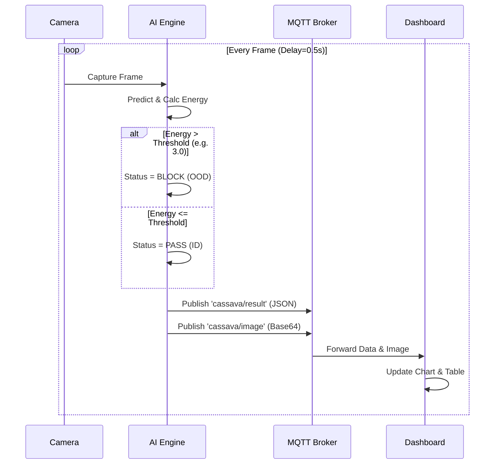
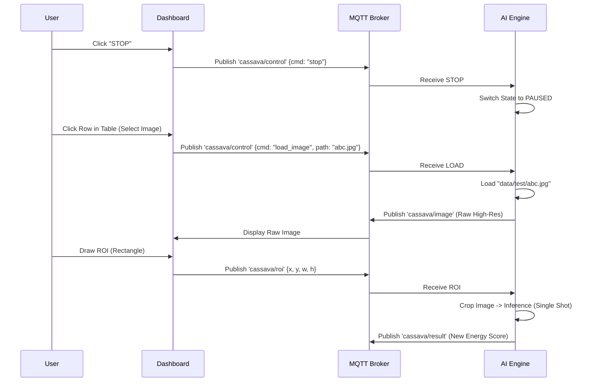

# Cassava OOD Detection System: Technical Architecture

## 1. Executive Summary
This system provides real-time, robust detection of Cassava Leaf Diseases on edge devices (Jetson Nano). It features **Energy-based Out-of-Distribution (OOD) Detection** to reject non-plant objects and a **Bi-directional Web Dashboard** for remote control and interactive analysis.

---

## 2. System Architecture

The system follows a decoupled architecture using MQTT as the central nervous system.

```mermaid
graph TD
    subgraph "Edge Device (Jetson Nano)"
        Cam[Camera / File Source] -->|Frames| AI[AI Engine<br/>(MobileNetV3 + Energy OOD)]
        AI -->|Annotated Image| MQTT_Pub[MQTT Publisher]
        MQTT_Sub[MQTT Subscriber] -->|Control/ROI| AI
    end

    subgraph "Communication Layer"
        Broker((MQTT Broker<br/>HiveMQ/Mosquitto))
    end

    subgraph "Control Station (Host PC)"
        Flask[Flask Backend<br/>Socket.IO] <-->|Sub/Pub| Broker
        Browser[Web Dashboard<br/>Chart.js + Canvas] <-->|WebSocket| Flask
    end

    AI -.-> Broker
    Broker -.-> AI
    Flask -.-> Broker
    Broker -.-> Flask
```

---

## 3. Operations & Message Flow

### A. Live Inference Loop (Autonomy)
The system continuously processes frames and broadcasts results.



### B. Interactive Review (Human-in-the-Loop)
The user stops the stream to analyze a specific image region.



---

## 4. MQTT Protocol Specification

### 1. `cassava/result` (Jetson -> Dashboard)
Broadcasts the classification result for the current frame.
```json
{
  "label": "CMD",         // Predicted Class (or Class with max prob)
  "confidence": 0.98,     // Softmax Probability (0.0 - 1.0)
  "energy": -4.25,        // Free Energy Score
  "status": "PASS",       // "PASS", "BLOCK (OOD)", or "LOW CONFIDENCE"
  "color": "(0, 255, 0)", // RGB Color code for UI (Green/Red/Yellow)
  "path": "IMG_123.jpg"   // Filename (for table tracking)
}
```

### 2. `cassava/image` (Jetson -> Dashboard)
Broadcasts the visualized frame.
- **Payload**: Raw Base64 encoded string of the JPEG image.
- **Note**: Sent ONLY if a client is connected to avoid bandwidth waste.

### 3. `cassava/control` (Dashboard -> Jetson)
Sends system commands.
```json
// Stop Inference
{"cmd": "stop"}

// Start Inference
{"cmd": "start"}

// Load Specific Image (Review Mode)
{"cmd": "load_image", "path": "train-cbb-512.jpg"}
```

### 4. `cassava/roi` (Dashboard -> Jetson)
Sends coordinates for Region of Interest analysis.
```json
{
  "x": 0.25, // Normalized coordinates (0.0 - 1.0)
  "y": 0.10,
  "w": 0.50,
  "h": 0.40
}
```

### 5. `cassava/config` (Dashboard -> Jetson)
Updates system parameters on the fly.
```json
{
  "threshold": 3.0, // New Energy Threshold
  "delay": 1.5      // Loop delay in seconds
}
```

---

## 5. Technical Specifications

### AI Engine (`inference.py`)
- **Model**: MobileNetV3 Large (Custom Head: 5 Classes).
- **OOD Method**: Energy-based with Outlier Exposure.
    - **Training targets**: ID < -5.0, OOD > -10.0 (LogSumExp).
    - **Inference logic**: Free Energy = -LogSumExp.
    - **Rejection**: If `Energy > Threshold` (Default: 3.0), classify as OOD.
- **Optimization**: Headless mode, TorchScript ready (optional).

### Dataset & Training
- **ID Data**: Cassava Leaf Disease (~21k images).
- **OOD Data**: Flowers102 (~8k images) used as "Noise".
- **Loss Function**:
    $$ \mathcal{L} = \mathcal{L}_{CE} + \lambda \cdot (\max(0, E_{in} - m_{in})^2 + \max(0, m_{out} - E_{out})^2) $$

### Dashboard (`src/dashboard`)
- **Framework**: Flask + Flask-SocketIO.
- **Frontend**: Bootstrap 5, Chart.js (Real-time plotting), HTML5 Canvas (ROI drawing).
- **Logic**: 
    - **Upsert Table**: Prevents duplicate rows when re-scanning images.
    - **Watchdog**: Detects if Jetson goes offline (no MQTT heartbeat for 10s).

---

## 6. Hardware Environment

### Target Device: NVIDIA Jetson Nano
- **CPU**: Quad-core ARM A57 @ 1.43 GHz.
- **GPU**: 128-core Maxwell.
- **RAM**: 4GB LPDDR4.
- **OS**: Ubuntu 18.04 (L4T 32.7.1).
- **Docker**: L4T-PyTorch base container (r32.7.1-pth1.10).

### Performance Constraints
- **Inference Speed**: ~15-20 FPS (MobileNetV3).
- **VRAM Usage**: ~1.5GB (System is optimized to fit within 4GB limit).

---

## 7. Troubleshooting Guide

| Issue | Possible Cause | Solution |
| :--- | :--- | :--- |
| **"OSError: libcurand.so"** | Missing GPU runtime | Always add `--runtime nvidia` to your `docker run` command. |
| **"MQTT Disconnected"** | Broker unreachable | Check network/firewall. Use `broker.hivemq.com` for quick test or local `mosquitto`. |
| **"Model not found"** | Missing `.pth` file | Ensure `cassava_mobilenet_v3_robust.pth` is in `checkpoints/`. |
| **"Blocking Valid Images"** | Threshold too low | Increase Energy Threshold on Dashboard (Try `3.0` - `5.0`). |
| **"Camera not found"** | Docker permissions | Add `--device /dev/video0` and `--privileged` flags. |

---

## 8. Future Roadmap

1.  **TensorRT Optimization**: Convert the `.pth` model to `.trt` engine using NVIDIA FP16 optimization for >40 FPS inference.
2.  **Mobile App**: Port the Web Dashboard to React Native for field usage on tablets.
3.  **Active Learning**: Implement a "Report Error" button on the dashboard to collect OOD edge cases for the next training cycle.
